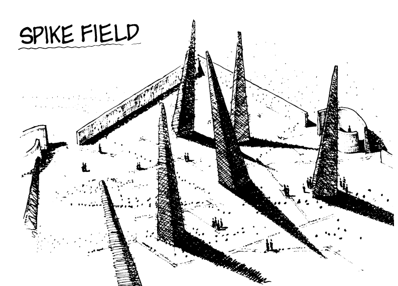
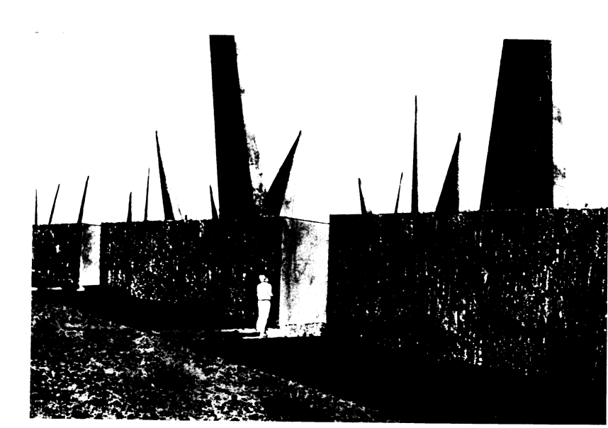
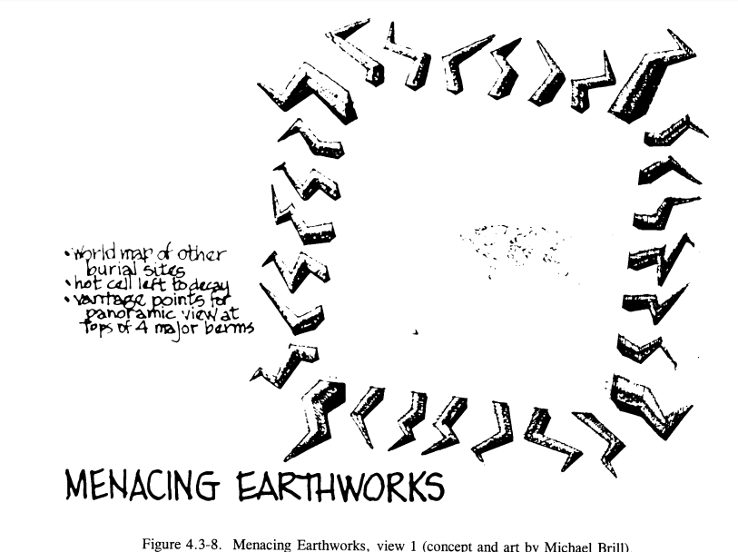
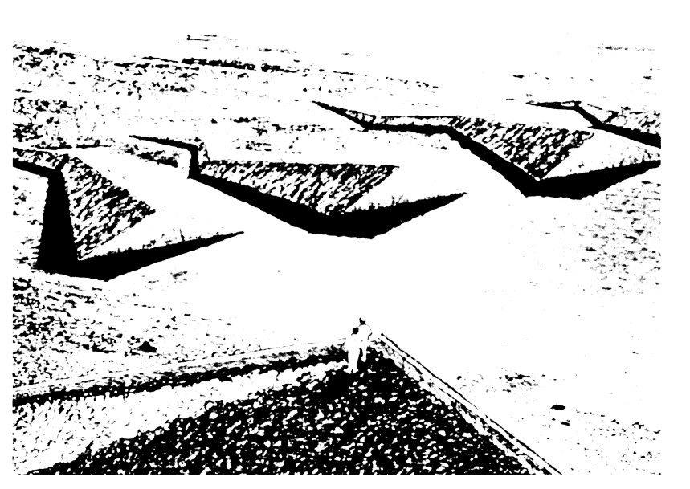
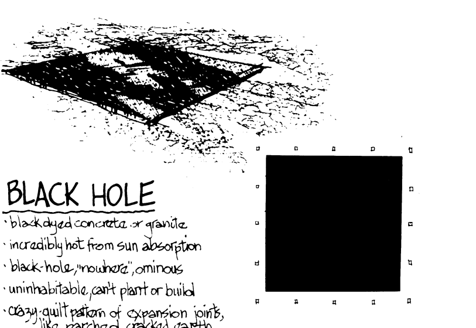

## Research 2-4 :: The Future Anterior
This historical epoch has been named the Anthropocene because of the overwhelming impact humans have made on our planet’s ecosystem. The Sixth Extinction posets that we are in the midst of a massive dying. But unlike the first five extinctions, this one is not quite as cinematic… no asteroids or eruptions or pandemics.  Rather this extinction is marked by the cumulative effects of mundane human activities. The leaking of greenhouse gases due to our daily grocery store visits and the silent costs of a destructive type of mass consumption that the global north has been enjoying for more than a century.  Humans are no longer biological agents of the earth.  We are geological agents.  We are the weather. We are the stuff that is capable of intervening and disrupting geological processes.  

The Sixth Extinction is a massive topic that bridges fields from semiotics to chemistry.  The scope and breadth of the topic is so large that I was even having trouble isolating a small enough part to focus on. So I tried a new approach. This week I allowed my research to be fumbling and tangential in an attempt to explore topics and ideas sparked through my selected texts.  
While at Bobst I stumbled across a collection of scientific and sociological essays titled the Anthropology of Extinction. In one essay the author mentions someone named Jean Claude Carrier who observes that the future anterior tense — the tense used to describe an action that will finish in the future — is fading away from everyday speech.  This observation, to me, seemed incredibly poetic. “What are grammatical tenses,” asks Carrière, “if not the painstaking attempt of our precise, meticulous minds to envisage all the possible shapes that time can take, all the ways in which we relate to time within the domain of our thoughts and actions?” The loss of the future anterior perhaps suggests that somewhere in our psyche we have lost faith in the future - lost faith in our ability to effect change - lost our ability to imagine a better future.  

With this view, Its no wonder that we have lost the future anterior.  In a world where evidence of planetary destruction assault us daily, governments seem unwilling to envision policy that outlives an election cycle. This line of thinking reminded me of research I had begun last year about Nuclear Waste. In Savage Dreams by Rebecca Solnit she mentions a Department of Energy paper about how to store radioactive waste. The issue of radioactive storage is one of only a handful of examples that I can think of where the government approaches public policy with the type of geologic foresite that future climate policy might require.  But interestingly the tangible problem of deep geological disposal of dangerous waste gives way to a more abstract problem: how do you even label this stuff?  

Interestingly, the DOE suggests that “Before one can communicate with future societies about the location and dangers of the waste, it is important to consider with whom one is trying to communicate ." This question of future societies was addressed using a multidisciplinary panel of experts in fields deemed pertinent. A group was formed by the DOE called the Futures Panel, and included individuals with backgrounds in history, future studies, economics, law, physics, sociology, geography, engineering, political science, risk analysis, agriculture, climatology, history, and demographics.

The group imagines a few potential future civilizations, including:  

1. One where human existence has been reduced to what can be supported by a metal-using technology similar to that of early medieval Europe  
2. One where Human existence went through a period of global catastrophe in which it was reduced to illiteracy and something bordering on a Stone Age level of technology, and then redeveloped new patterns of technological sophistication, new literacy, and new science.

The DOE group goes on to propose a few massive earth works to denote the particular dangers of the radioactive site.  

 
  
 
 
 

Of interest to me here is the defeatist attitude that the DOE has adopted.  As if both the nuclear waste and its radioactive decay were always inevitable and unavoidable.  Instead of committing tax payer dollars to scientific research about waste disposal and community outreach, the DOE chose to assemble teams of futurists to discuss the possibility of signaling radioactive danger to future societies.  Perhaps its fitting that we can use he future anterior tense here to say that the radioactive waste will have finished being dangerous in over 10,000 years…but truthfully its more fitting to remember that this project was scrapped and defunded.  

Sodikoff, Genese Marie, ed. The Anthropology of Extinction : Essays on Culture and Species Death. Bloomington, IN, US: Indiana University Press, 2011. ProQuest ebrary. Web. 4 February 2017.  

Kathleen M. Trauth, Stephen C. Hera, Robert V. Guzowsti. 1993. Expert Judgment on Markers to Deter Inadvertent Human Intrusion into the Waste Isolation Pilot Plant  SAND88-2871. Albuquerque, NM: Sandia National Labs  

http://www.wipp.energy.gov/PICsProg/Test1/SAND%2092-1382.pdf  

https://www.osti.gov/scitech/servlets/purl/6705990  

