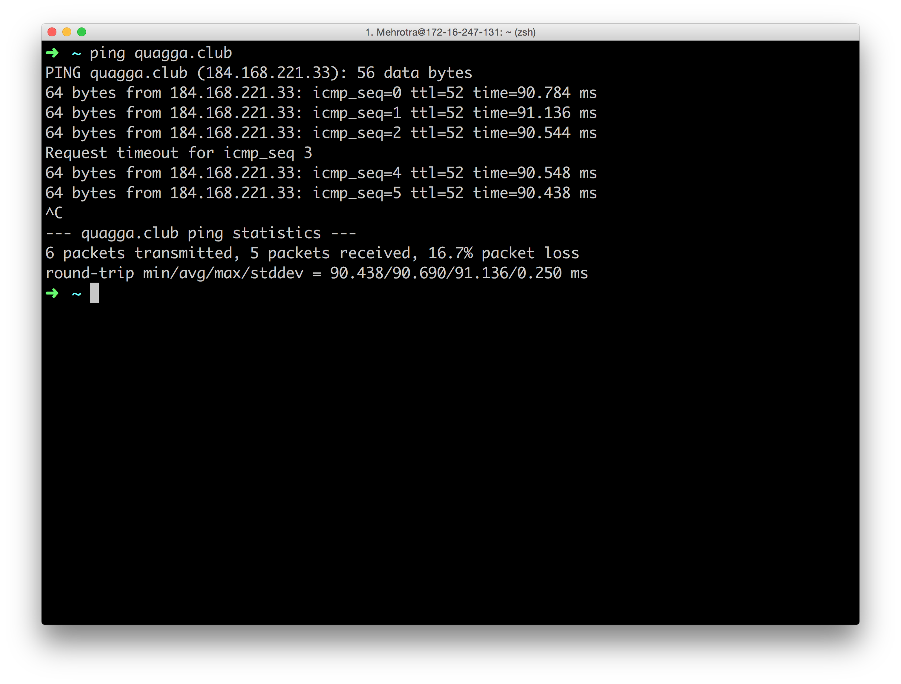
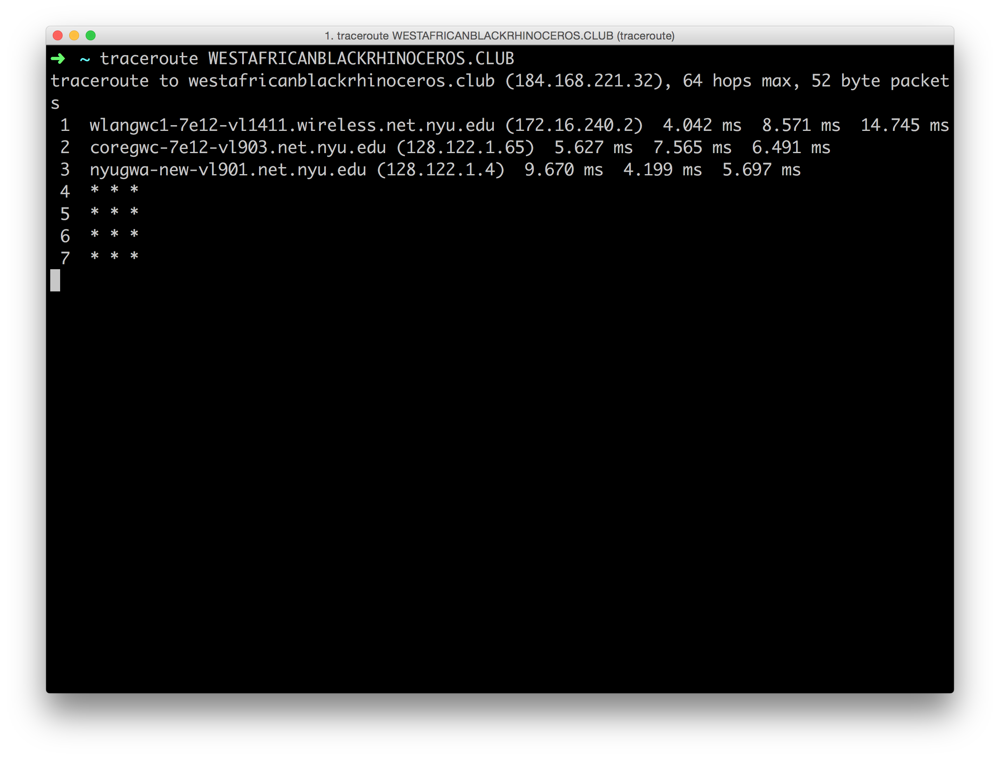

## Resolution
I wanted to begin by exploring relations between species extinction and the massive persistence of information stored on the internet.  The internet can be a vehicle for preservation - from the mundane to the crucial.  Is death simply the corporeal fact that your heart does not beat, or is there something left in the data you leave behind? Could I create some kind relationship to this animal that I inadvertently killed?  
  
I started by purchasing the domain names of various animals that human activity has killed:  

I then thought of ways to summon these animals. I pinged them:  

  

How do I find them, what is my path to them?    

who are they?  

  

Did this bring me any closer to the animal that I had killed? No, I don’t really think so. These species are extinct.  And trying to conjure them through the wires of the internet seemed to lesson the gravity of the very fact of their extinction.    

I decided to not resolve the domain names to actual servers.  Without this resolution these domain names will simply be empty space carved out for me in the alphanumeric galaxy of the wide web.    

 

